# FastMiniMQ 性能设计

### 前言

MQ 基础功能之一是流量削峰，因此高性能是 MQ 的核心要性之一。

> 流量削峰介绍
> <div align=center></div>
> 
>MQ 作为中间件，并不与参与业务处理，因此 MQ 并不提高业务处理总量，MQ 在流量高峰期削峰，暂存多余的（异步任务）消息，使得业务服务器维持平稳处理，避免系统瘫痪，等到流量低谷期，业务服务器能够承载当前流量并且仍有空闲的 CPU 等资源后再处理完暂存消息。
> <div align=center></div>
> 
> 由上述可以看出，MQ 作为业务服务的门面系统可以提高整体的突发性能。

### 服务器高速写

MQ 的削峰能力取决 MQ 服务器的最大写入吞吐量，其与服务器硬件配置密切关联。FastMiniMQ 的首要目标是尽可能把 MQ 服务器写入吞吐量提高到服务器硬件配置所能承载的极限。

MQ 服务器的最大写入吞吐量取决于写入过程中所有 IO 部件中吞吐量最小者，其中服务器硬盘时常就是吞吐量最小者，因此合理的刷盘机制对 MQ 的整体性能至关重要。

<div align=center></div>

对于绝大多数服务器磁盘批量顺序写性能最佳，因此在应对大流量时，MQ 应该尽可能每次按 4K/8K 大小顺序写入磁盘。在 FastMiniMQ 中所有写入磁盘的日志都会预先写入内存缓存池中，并且会有一个单独的线程尽可能按 4K/8K 大小循环把其内容批量顺序写入磁盘。在流量低谷时，当一条目日志写入磁盘后内存缓存池可能没有或者只有一条待写入日志，此时日志写入磁盘会按逐条写入，随着流量上升，单条写入速度跟不上外部请求流速，一条目日志写入磁盘后内存缓存池中会积压起多条待写入日志，此时日志写入磁盘就会按多条批量写入。随着流量达到高峰，服务器磁盘 IO 按 4K/8K 大小顺序写达到吞吐量极限，无法及时处理更多内存缓存池的内容，内存缓存池积压久后就会开始溢出，无法写入内存缓存池的日志请求会被直接弹回，也即是限流。

<div align=center></div>

> 有些 MQ 将高性能归结于 Zero-Copy，然而 Zero-Copy 对提高 MQ 吞吐量实际没有帮助，有些未使用 Zero-Copy 技术的 MQ 之所以性能低，是因为其进程内部操作不当产生阻塞导致。
>
> Zero-Copy 机制允许跳过物理内存拷贝，减少了传输过程中所需通行的 IO 部件，缩短了单个消息的处理时间，但不影响 IO 部件（网卡和硬盘）单位时间所允许的通行量。MQ 的最大吞吐量取决于传输过程中所有 IO 部件中吞吐量最小者，内核空间 Write/Read 缓存区和内核 Socket 缓冲区吞吐量高于硬盘，因此跳过物理内存拷贝并不影响其吞吐量上限。不仅如此，多节点进行数据同步时，在稳定网络环境下，系统整体的吞吐量上限与系统内部节点数量并没有关系，只取决于吞吐量最小的部件。
>
> 内核空间的缓冲区和 Socket 的缓冲区两者与用户内存的交互过程虽然会增加单个消息的处理时间，但实际上对响应时间（RT）影响并不大，响应时间（RT）的瓶颈依然是在硬盘 IO 导致的延迟。

### 服务器高速读

FastMiniMQ 的目标之一是提供高速读取数据能力，然而读取过程相比写入过程面临两个问题：

其一，对于绝大多数服务器磁盘批量顺序读写性能最佳，但是由于 MQ 需要支持多主题队列因而不可能实现单线程批量顺序读。不论存储用单文件或者多文件，在并发读取大量不同主题队列日志时必然是近乎随机读。

其二，大量磁盘读取会严重影响磁盘写入的吞吐量，导致系统整体实际应对突发流量的能力严重下降。在流量削峰中暂存消息任务优先级高于消费消息，必须优先满足磁盘写入的吞吐量。

由上述可以看出，读取过程不能照写入过程的方式其需要尽可能规避磁盘读取。

在 FastMiniMQ 中，所有主题队列都存储在同一逻辑文件（支持无限扩容）中，并且会有一块内存区动态映射到逻辑文件的末尾段。默认情况下这块内存映射区大小是 1 G，其适应低端机千级 QPS 需求用户。用户可以按需调整大小，对于高性能需求的用户，可以调整配置为 64 G / 128 G / 256 G，这时候 FastMiniMQ 可以看作是具有持有久化功能的内存型消息队列系统。

<div align=center></div>

写入逻辑文件的日志都会预先写入映射内存中，读取时若日志存储在映射区间则从映射内存中读取，无需磁盘读取。映射内存的结构用无锁环形队列。FastMiniMQ 无锁环形队列优先满足写入，对于日志读取用后置检测确保其安全性。

<div align=center></div>

***映射内存结构示例代码***

```java
// Support single thread write and multi thread read
class RingBuffer {

    private byte[][] buffers;
    private int unit;
    private int count;
    private long capacity;
 
    private volatile long writeIndex;
    private volatile long prepareWriteIndex;
    
    public RingBuffer(int unit, int count) {
        // unit and count must be powers of 2
        this.unit = unit;
        this.count = count;
        this.capacity = (long) unit * (long) count;
        
        buffers = new byte[count][];
        for (int i = 0; i < buffers.length; i++) {
            buffers[i] = new byte[unit];
        }
    }
    
    public int write(ByteBuffer src) {
        int remaining = src.remaining();
        int length = remaining;
        
        // increment prepare write index before writing
        prepareWriteIndex += length;
        
        long currentIndex = writeIndex;
        int bufferIndex = bufferIndex(currentIndex);
        int bufferPos = bufferPos(currentIndex);
        
        while (remaining > 0) {
            byte[] dest = buffers[bufferIndex];
            int localLength = Math.min(remaining, dest.length - bufferPos);
            src.get(dest, bufferPos, localLength);
            bufferPos += localLength;
            remaining -= localLength;
            if (bufferPos == dest.length) {
                bufferIndex = (bufferIndex + 1) & (buffers.length - 1);// next buffer index
                bufferPos = 0;
            }
        }
        
        writeIndex += length;
        return length;
    }

    public int read(ByteBuffer dst, long position) {
        long writeIndex = this.writeIndex;
        if (position >= writeIndex || position < prepareWriteIndex - capacity) {
            return -1;
        }
        
        int backup = dst.position();
        
        // start loading
        int bufferIndex = bufferIndex(position);
        int bufferPos = bufferPos(position);
        long readIndex = position;
        
        int remaining = dst.remaining();
        int length = remaining;
        while (remaining > 0 && readIndex < writeIndex) {
            byte[] src = buffers[bufferIndex];
            int localLength = Math.min(remaining, src.length - bufferPos);
            dst.put(src, bufferPos, localLength);
            bufferPos += localLength;
            readIndex += localLength;
            remaining -= localLength;
            if (bufferPos == src.length) {
                bufferIndex = (bufferIndex + 1) & (buffers.length - 1);// next buffer index
                bufferPos = 0;
            }
        }
        // end loading
        
        // check the latest read security zone
        // condition position + (length - remaining) >= this.writeIndex can be ignored
        if (position < prepareWriteIndex - capacity) { 
            dst.position(backup);
            return -1;
        }
        return length - remaining;
    }
    
    private int bufferIndex(long position) {
        return (int) ((position / unit) & (count - 1));
    }
    
    private int bufferPos(long position) {
        return (int) (position & (unit - 1));
    }
    
}
```

### 消费者批处理

消费者在消息业务处理过程中往往需要进行数据库事务操作，批处理能有效削减数据库事务操作次数，大幅提高处理效率。FastMiniMQ 的目标之一是尽可能提高消费者的并行处理和批量处理能力。在 FastMiniMQ 中，消费者可以对每个业务处理线程单独实行消息批处理操作。

在 FastMiniMQ 消费模型中，一个主题在一个中间件服务器节点至多只有一个消费队列，消费者可以根据需要将一个消费队列拆分成任意多个虚拟消费队列。例如，某组消费者中共有 2 个消费者，每个消费者每次至多从中间件服务器读取 200 行消息记录，此时可以配置虚拟消费队列数量为 2，跨幅步长为 200， 2 个消费者各种独占 1 个虚拟消费队列，第 1 个虚拟消费队列消息记录编号区间依次是 [0,200),[400,600) ...... 以此类推，第 2 个虚拟消费队列消息记录编号区间依次是 [200,400),[600,800) ...... 以此类推。

<div align=center></div>

### 性能测试

见 [FastMiniMQ 测试用例](https://github.com/guochaosheng/FastMiniMQ/tree/master/docs/test/testcase_list.md)

