# Reliability TestCase (Transaction)

​		4 个 producer 节点（2核8G内存），2 个 broker 节点（2核8G内存），4 个 consumer 节点（4核8G内存），1 个 Chaos Monkey 节点，256 个消息 topic，128 字节消息 body。

## 结构图



**节点清单** 

| 序号  | 节点名称           | 节点地址                          | 预装软件                  |
| ---- | ----------------- | --------------------------------- | ------------------------- |
| 1    | Broker 1 节点     | 47.92.162.80（内网 172.16.0.14）  | openjdk-1.8.0             |
| 2    | Broker 2 节点     | 39.100.49.216（内网 172.16.0.17） | openjdk-1.8.0             |
| 3    | Producer 1 节点   | 39.100.45.176                     | openjdk-1.8.0 + mysql 8.0 |
| 4    | Producer 2 节点   | 39.100.47.168                     | openjdk-1.8.0 + mysql 8.0 |
| 5    | Producer 3 节点   | 47.92.251.46                      | openjdk-1.8.0 + mysql 8.0 |
| 6    | Producer 4 节点   | 39.98.213.141                     | openjdk-1.8.0 + mysql 8.0 |
| 7    | Consumer 1 节点   | 39.100.17.56                      | openjdk-1.8.0 + mysql 8.0 |
| 8    | Consumer 2 节点   | 39.100.52.151                     | openjdk-1.8.0 + mysql 8.0 |
| 9    | Consumer 3 节点   | 39.100.50.16                      | openjdk-1.8.0 + mysql 8.0 |
| 10   | Consumer 4 节点   | 39.100.51.172                     | openjdk-1.8.0 + mysql 8.0 |
| 11   | Chaos Monkey 节点 | 47.92.234.28                      | openjdk-1.8.0             |


## 测试方案

​		Producer 侧节点持续生产事务消息，Consumer 侧节点持续消费事务消息，每间隔 3 分钟 Chaos Monkey 在其余 10 节点中随机选择部分或者全部节点强制重启，也就是说单次强制重启节点数在 1 至 10 区间范围内，Chaos Monkey 确保 1-10 每种情况至少包含一次。Chaos Monkey 通过 SSH 指令实现对节点的远程操作，远程节点执行强制重启后 30 秒节点应用再重新启动。

Chaos Monkey 持续 300 分钟（节点数 10 的平方乘以时间间隔 3 分钟）后停止强制重启操作，启动数据校验进程，数据校验进程等待 Consumer 消费结束后开始检查 Producer 侧已完成投递事务消息和 Consumer 侧已消费处理消息是否一致。

校验生产和消费消息是否一致，分成如下 2 种情况：

1. 当 Producer 侧存在已开始第二阶段投递但未确认投递成功消息，此时不同状态消息数量满足如下关系

* Producer 侧已完成提交事务消息总数量 <= Consumer 侧已消费处理消息总数量

* Producer 侧已完成提交事务消息总数量 + 已开始第二阶段投递但未确认投递成功消息总数量 >= Consumer 侧已消费处理消息总数量

2. 当 Producer 侧全部事务消息投递成功（或者不存在已开始第二阶段投递但未确认投递成功消息），此时不同状态消息数量满足如下关系

* Producer 侧已完成提交事务消息总数量 = Consumer 侧已消费处理消息总数量

## 执行命令清单和操作流程

| 序号 | 执行命令或者操作                                             | 说明                                                         |
| :--- | :----------------------------------------------------------- | :----------------------------------------------------------- |
| 1    | mvn clean install                                            | 编译打包生成 FastMiniMQBroker.jar 和 FastMiniMQTest.jar      |
| 2    | scp -r FastMiniMQBroker.jar broker@47.92.162.80:/opt <br/>scp -r FastMiniMQBroker.jar broker@39.100.49.216:/opt | 复制 FastMiniMQBroker.jar 至 broker 节点                     |
| 3    | scp -r FastMiniMQTest.jar producer@39.100.45.176:/opt <br/>scp -r FastMiniMQTest.jar producer@39.100.47.168:/opt <br/>scp -r FastMiniMQTest.jar producer@47.92.251.46:/opt <br/>scp -r FastMiniMQTest.jar producer@39.98.213.141:/opt | 复制 FastMiniMQTest.jar 至 producer 节点                     |
| 4    | scp -r FastMiniMQTest.jar consumer@39.100.17.56:/opt <br/>scp -r FastMiniMQTest.jar consumer@39.100.52.151:/opt <br/>scp -r FastMiniMQTest.jar consumer@39.100.50.16:/opt <br/>scp -r FastMiniMQTest.jar consumer@39.100.51.172:/opt | 复制 FastMiniMQTest.jar 至 consumer 节点                     |
| 5    | 分别连接所有 Producer 和 Consumer 节点上的 MYSQL，新建一个 mq_transaction 数据库 |                                                              |
| 6    | scp -r checker-4-2-4-nodes.properties monkey-4-2-4-nodes.properties chaos@47.92.234.28:/opt | 复制配置文件 checker-4-2-4-nodes.properties 和 monkey-4-2-4-nodes.properties 至 chaos-monkey 节点 |
| 7    | nohup java -Dchecker.configurationFile=/opt/checker-4-2-4-nodes.properties -Dmonkey.configurationFile=/opt/monkey-4-2-4-nodes.properties -cp /opt:/opt/* org.nopasserby.fastminimq.reliability.ChaosTransactionTest >> transaction_chaos_test.log 2>&1 & | 运行 chaos-monkey，等待结果报告                              |


**checker-4-2-4-nodes.properties 配置说明和详情**

```properties
# 用途：该配置用于 chaos-monkey 校验生产和消费消息是否一致时连接访问 Producer/Consumer 各个节点上数据库
#
# 配置分 2 部分，声明生产者和消费者组各个节点配置的别名以及声明各个节点配置具体的参数名称和值
# 
# 第 1 步：
# 声明生产者组各个节点配置的别名，多个节点间按（英文）逗号隔开
# producer.label=producer1,producer2,producer3,producer4 
# 声明消费者组各个节点配置的别名，多个节点间按（英文）逗号隔开
# consumer.label=consumer1,consumer2,consumer3,consumer4
# 
# 第 2 步：
# 声明节点配置具体的参数名称和值，格式：节点配置的别名.参数名称=参数值，以 producer1 做例声明如下
# producer1.jdbcUrl=XXX  
# producer1.username=XXX
# producer1.password=XXX
# producer1.maximumPoolSize=XXX
# 参数名称含义说明
# jdbcUrl：数据库连接配置
# username: 数据库登录用户名称
# password: 数据库登录用户密码
# maximumPoolSize：数据库连接池大小最大值，默认 10
#

### producer jdbc setting
producer.label=producer1,producer2,producer3,producer4

producer1.jdbcUrl=jdbc:mysql://39.100.45.176:3306/mq_transaction?serverTimezone=GMT%2b8&useSSL=false&useUnicode=true&characterEncoding=utf-8&autoReconnect=true
producer1.username=root
producer1.password=123456
producer1.maximumPoolSize=5

producer2.jdbcUrl=jdbc:mysql://39.100.47.168:3306/mq_transaction?serverTimezone=GMT%2b8&useSSL=false&useUnicode=true&characterEncoding=utf-8&autoReconnect=true
producer2.username=root
producer2.password=123456
producer2.maximumPoolSize=5

producer3.jdbcUrl=jdbc:mysql://47.92.251.46:3306/mq_transaction?serverTimezone=GMT%2b8&useSSL=false&useUnicode=true&characterEncoding=utf-8&autoReconnect=true
producer3.username=root
producer3.password=123456
producer3.maximumPoolSize=5

producer4.jdbcUrl=jdbc:mysql://39.98.213.141:3306/mq_transaction?serverTimezone=GMT%2b8&useSSL=false&useUnicode=true&characterEncoding=utf-8&autoReconnect=true
producer4.username=root
producer4.password=123456
producer4.maximumPoolSize=5

### consumer jdbc setting
consumer.label=consumer1,consumer2,consumer3,consumer4

consumer1.jdbcUrl=jdbc:mysql://39.100.17.56:3306/mq_transaction?serverTimezone=GMT%2b8&useSSL=false&useUnicode=true&characterEncoding=utf-8&autoReconnect=true
consumer1.username=root
consumer1.password=123456
consumer1.maximumPoolSize=5

consumer2.jdbcUrl=jdbc:mysql://39.100.52.151:3306/mq_transaction?serverTimezone=GMT%2b8&useSSL=false&useUnicode=true&characterEncoding=utf-8&autoReconnect=true
consumer2.username=root
consumer2.password=123456
consumer2.maximumPoolSize=5

consumer3.jdbcUrl=jdbc:mysql://39.100.50.16:3306/mq_transaction?serverTimezone=GMT%2b8&useSSL=false&useUnicode=true&characterEncoding=utf-8&autoReconnect=true
consumer3.username=root
consumer3.password=123456
consumer3.maximumPoolSize=5

consumer4.jdbcUrl=jdbc:mysql://39.100.51.172:3306/mq_transaction?serverTimezone=GMT%2b8&useSSL=false&useUnicode=true&characterEncoding=utf-8&autoReconnect=true
consumer4.username=root
consumer4.password=123456
consumer4.maximumPoolSize=5
```


**monkey-4-2-4-nodes.properties 配置说明和详情**

```properties
# 用途：该配置用于 chaos-monkey 连接操作 Broker/Producer/Consumer 节点
#
# 配置分 2 部分，声明消息代理组、生产者和消费者组各个节点配置的别名以及声明各个节点配置具体的 SSH 配置和 Shell 命令
# 
# 第 1 步：
# 声明消息代理组各个节点配置的别名，多个节点间按（英文）逗号隔开
# broker.label=broker1,broker2
# 声明生产者组各个节点配置的别名，多个节点间按（英文）逗号隔开
# producer.label=producer1,producer2,producer3,producer4 
# 声明消费者组各个节点配置的别名，多个节点间按（英文）逗号隔开
# consumer.label=consumer1,consumer2,consumer3,consumer4
# 
# 第 2 步：
# 声明节点配置具体的参数名称和值，格式：节点配置的别名.参数名称=参数值，以 broker1 做例声明如下
# broker1.ssh.host=XXX
# broker1.ssh.username=XXX
# broker1.ssh.password=XXX
# broker1.system.reboot=XXX
# broker1.application.startup=XXX
# 参数名称含义说明
# ssh.host：目标节点 IP
# ssh.username: 目标节点 SSH 登录用户账号
# ssh.password: 目标节点 SSH 登录用户密码
# system.reboot：重启系统 Shell 命令，reboot -nf 表示强制重启，跳过 init 的处理和 sync 操作
# application.startup：启动应用 Shell 命令
#

### Broker Group
broker.label=broker1,broker2

broker1.ssh.host=47.92.162.80
broker1.ssh.username=root
broker1.ssh.password=FastMiniMQ@123456
broker1.system.reboot=reboot -nf
broker1.application.startup=java -Ddata.dir=/data/fastminimq -Dflush.sync=true -XX:+UseG1GC -cp /opt:/opt/* org.nopasserby.fastminimq.FastMiniMQBroker

broker2.ssh.host=39.100.49.216
broker2.ssh.username=root
broker2.ssh.password=FastMiniMQ@123456
broker2.system.reboot=reboot -nf
broker2.application.startup=java -Ddata.dir=/data/fastminimq -Dflush.sync=true -XX:+UseG1GC -cp /opt:/opt/* org.nopasserby.fastminimq.FastMiniMQBroker

### Producer Group
producer.label=producer1,producer2,producer3,producer4

producer1.ssh.host=39.100.45.176
producer1.ssh.username=root
producer1.ssh.password=FastMiniMQ@123456
producer1.system.reboot=reboot -nf
producer1.application.startup=java -DbrokerHosts='172.16.0.14:6001;172.16.0.17:6001' -DmessageCount=500000 -cp /opt:/opt/* org.nopasserby.fastminimq.reliability.TransactionProducerTest

producer2.ssh.host=39.100.47.168
producer2.ssh.username=root
producer2.ssh.password=FastMiniMQ@123456
producer2.system.reboot=reboot -nf
producer2.application.startup=java -DbrokerHosts='172.16.0.14:6001;172.16.0.17:6001' -DmessageCount=500000 -cp /opt:/opt/* org.nopasserby.fastminimq.reliability.TransactionProducerTest

producer3.ssh.host=47.92.251.46
producer3.ssh.username=root
producer3.ssh.password=FastMiniMQ@123456
producer3.system.reboot=reboot -nf
producer3.application.startup=java -DbrokerHosts='172.16.0.14:6001;172.16.0.17:6001' -DmessageCount=500000 -cp /opt:/opt/* org.nopasserby.fastminimq.reliability.TransactionProducerTest

producer4.ssh.host=39.98.213.141
producer4.ssh.username=root
producer4.ssh.password=FastMiniMQ@123456
producer4.system.reboot=reboot -nf
producer4.application.startup=java -DbrokerHosts='172.16.0.14:6001;172.16.0.17:6001' -DmessageCount=500000 -cp /opt:/opt/* org.nopasserby.fastminimq.reliability.TransactionProducerTest

### Consumer Group
consumer.label=consumer1,consumer2,consumer3,consumer4

consumer1.ssh.host=39.100.17.56
consumer1.ssh.username=root
consumer1.ssh.password=FastMiniMQ@123456
consumer1.system.reboot=reboot -nf
consumer1.application.startup=java -DbrokerHost=172.16.0.14:6001 -Dgroups='group1;group2' -DtargetGroups=group1 -cp /opt:/opt/* org.nopasserby.fastminimq.reliability.TransactionConsumerTest

consumer2.ssh.host=39.100.52.151
consumer2.ssh.username=root
consumer2.ssh.password=FastMiniMQ@123456
consumer2.system.reboot=reboot -nf
consumer2.application.startup=java -DbrokerHost=172.16.0.14:6001 -Dgroups='group1;group2' -DtargetGroups=group2 -cp /opt:/opt/* org.nopasserby.fastminimq.reliability.TransactionConsumerTest

consumer3.ssh.host=39.100.50.16
consumer3.ssh.username=root
consumer3.ssh.password=FastMiniMQ@123456
consumer3.system.reboot=reboot -nf
consumer3.application.startup=java -DbrokerHost=172.16.0.17:6001 -Dgroups='group1;group2' -DtargetGroups=group1 -cp /opt:/opt/* org.nopasserby.fastminimq.reliability.TransactionConsumerTest

consumer4.ssh.host=39.100.51.172
consumer4.ssh.username=root
consumer4.ssh.password=FastMiniMQ@123456
consumer4.system.reboot=reboot -nf
consumer4.application.startup=java -DbrokerHost=172.16.0.17:6001 -Dgroups='group1;group2' -DtargetGroups=group2 -cp /opt:/opt/* org.nopasserby.fastminimq.reliability.TransactionConsumerTest
```


## 在阿里云上的测试结果

* 基础信息

1. 服务器参数：

| 规格          | vCPU | 处理器型号                               | 内存（GiB） | 本地存储（GiB） | 网络基础带宽能力（出/入）（Gbit/s） | 网络突发带宽能力（出/入）（Gbit/s） | 网络收发包能力（出+入）（万PPS） | 连接数（万） | 多队列 | 云盘最大IOPS | 云盘最大吞吐量（MB/s） | 云盘带宽（Gbit/s） |
| :------------ | :--- | :--------------------------------------- | :---------- | :-------------- | :---------------------------------- | :---------------------------------- | :------------------------------- | :----------- | :----- | :----------- | :--------------------- | :----------------- |
| ecs.c6.xlarge | 2    | Intel Xeon(Cascade Lake) Platinum 8269CY | 8           | 高效云盘 40 G   | 1.0                                 | 3.0                                 | 30                               | 最高25       | 2      | 2280         | 140                    | 1                  |

2. 操作系统：CentOS 7.6 64bit
3. Maven 版本：Apache Maven 3.2.5
4. 编译 JDK 版本：Oracle jdk1.8.0_22164
5. 运行环境 JDK 版本：java-1.8.0-openjdk-1.8.0.252.b09-2.el7_8.x86_64
6. MYSQL 版本：8.0.22 MySQL Community Server - GPL
7. FastMiniMQ Transaction (Exactly Once) 可靠性测试报告（以下来自 Chaos Monkey 执行完毕后的输出报告）：

**各节点宕机次数汇总（日期 2020-12-30）**

| node name | node host     | down count |
| --------- | ------------- | ---------- |
|broker1    |47.92.162.80   |22          |
|broker2    |39.100.49.216  |18          |
|consumer1  |39.100.17.56   |11          |
|consumer2  |39.100.52.151  |13          |
|consumer3  |39.100.50.16   |12          |
|consumer4  |39.100.51.172  |15          |
|producer1  |39.100.45.176  |14          |
|producer2  |39.100.47.168  |12          |
|producer3  |47.92.251.46   |14          |
|producer4  |39.98.213.141  |14          |

**各节点宕机明细清单（日期 2020-12-30）**

| batch |  count    | broker1 | broker2 | consumer1 | consumer2 | consumer3 | consumer4 | producer1 | producer2 | producer3 | producer4 |
| ----- | ---- | ---- | ---- | ---- | ---- | ---- | ---- | ---- | ---- | ---- | ---- |
|0      |2      |             |             |             |             |             |15:26  |             |             |             |15:26  |
|1      |1      |             |15:29  |             |             |             |             |             |             |             |             |
|2      |1      |15:32  |             |             |             |             |             |             |             |             |             |
|3      |1      |15:35  |             |             |             |             |             |             |             |             |             |
|4      |1      |             |             |             |15:38  |             |             |             |             |             |             |
|5      |1      |             |             |             |15:41  |             |             |             |             |             |             |
|6      |1      |             |             |             |             |             |             |15:44  |             |             |             |
|7      |1      |             |             |             |             |             |             |15:47  |             |             |             |
|8      |1      |             |             |             |             |             |             |             |             |15:50  |             |
|9      |1      |             |             |             |             |             |             |             |15:53  |             |             |
|10     |4      |             |             |             |             |             |15:56  |             |15:56  |15:56  |15:56  |
|11     |1      |15:59  |             |             |             |             |             |             |             |             |             |
|12     |1      |             |16:02  |             |             |             |             |             |             |             |             |
|13     |1      |             |16:05  |             |             |             |             |             |             |             |             |
|14     |1      |             |16:08  |             |             |             |             |             |             |             |             |
|15     |1      |16:11  |             |             |             |             |             |             |             |             |             |
|16     |1      |16:14  |             |             |             |             |             |             |             |             |             |
|17     |1      |             |             |             |             |16:17  |             |             |             |             |             |
|18     |1      |             |             |             |16:20  |             |             |             |             |             |             |
|19     |1      |             |             |             |             |16:23  |             |             |             |             |             |
|20     |3      |16:26  |             |             |16:26  |             |16:26  |             |             |             |             |
|21     |1      |             |             |             |             |             |             |             |             |16:29  |             |
|22     |1      |             |             |16:32  |             |             |             |             |             |             |             |
|23     |1      |16:35  |             |             |             |             |             |             |             |             |             |
|24     |1      |16:38  |             |             |             |             |             |             |             |             |             |
|25     |1      |16:41  |             |             |             |             |             |             |             |             |             |
|26     |1      |16:44  |             |             |             |             |             |             |             |             |             |
|27     |1      |             |             |16:47  |             |             |             |             |             |             |             |
|28     |1      |             |             |             |16:50  |             |             |             |             |             |             |
|29     |1      |             |             |             |             |             |             |16:53  |             |             |             |
|30     |9      |16:56  |16:56  |             |16:56  |16:56  |16:56  |16:56  |16:56  |16:56  |16:56  |
|31     |1      |             |             |             |             |             |             |             |             |             |16:59  |
|32     |1      |             |             |             |             |             |             |             |17:02  |             |             |
|33     |1      |             |17:05  |             |             |             |             |             |             |             |             |
|34     |1      |             |             |             |             |             |             |             |17:08  |             |             |
|35     |1      |             |             |             |             |17:11  |             |             |             |             |             |
|36     |1      |             |             |             |             |             |17:14  |             |             |             |             |
|37     |1      |             |             |             |             |             |17:17  |             |             |             |             |
|38     |1      |             |             |             |             |17:20  |             |             |             |             |             |
|39     |1      |             |             |             |             |17:23  |             |             |             |             |             |
|40     |7      |17:26  |17:26  |             |             |17:26  |17:26  |17:26  |             |17:26  |17:26  |
|41     |1      |             |             |             |             |             |             |             |             |             |17:29  |
|42     |1      |             |17:32  |             |             |             |             |             |             |             |             |
|43     |1      |             |             |             |             |             |             |17:35  |             |             |             |
|44     |1      |             |             |             |             |             |             |             |             |             |17:38  |
|45     |1      |17:41  |             |             |             |             |             |             |             |             |             |
|46     |1      |             |             |             |             |             |             |             |17:44  |             |             |
|47     |1      |             |             |             |             |             |             |             |17:47  |             |             |
|48     |1      |             |             |             |             |             |             |             |             |             |17:50  |
|49     |1      |             |             |             |             |             |             |             |             |             |17:53  |
|50     |6      |             |             |17:56  |17:56  |17:56  |17:56  |17:56  |             |17:56  |             |
|51     |1      |             |             |17:59  |             |             |             |             |             |             |             |
|52     |1      |             |             |             |             |             |18:02  |             |             |             |             |
|53     |1      |             |             |             |             |             |             |             |             |18:05  |             |
|54     |1      |             |             |             |             |             |             |             |             |18:08  |             |
|55     |1      |             |18:11  |             |             |             |             |             |             |             |             |
|56     |1      |             |             |             |18:14  |             |             |             |             |             |             |
|57     |1      |             |             |             |             |             |             |             |18:17  |             |             |
|58     |1      |             |             |             |             |             |             |             |18:20  |             |             |
|59     |1      |             |             |             |18:23  |             |             |             |             |             |             |
|60     |8      |18:26  |18:26  |18:26  |18:26  |             |18:26  |18:26  |18:26  |18:26  |             |
|61     |1      |             |18:29  |             |             |             |             |             |             |             |             |
|62     |1      |             |             |             |             |             |             |18:32  |             |             |             |
|63     |1      |             |             |             |             |             |             |             |             |             |18:35  |
|64     |1      |             |             |             |             |             |             |             |             |             |18:38  |
|65     |1      |             |             |             |             |             |18:41  |             |             |             |             |
|66     |1      |             |             |             |             |             |             |             |18:44  |             |             |
|67     |1      |             |             |18:47  |             |             |             |             |             |             |             |
|68     |1      |             |             |             |             |             |             |18:50  |             |             |             |
|69     |1      |             |             |             |             |             |             |             |             |             |18:53  |
|70     |1      |18:56  |             |             |             |             |             |             |             |             |             |
|71     |1      |             |             |             |             |             |             |18:59  |             |             |             |
|72     |1      |             |             |             |             |             |19:02  |             |             |             |             |
|73     |1      |             |             |             |             |             |             |             |             |             |19:05  |
|74     |1      |19:08  |             |             |             |             |             |             |             |             |             |
|75     |1      |19:11  |             |             |             |             |             |             |             |             |             |
|76     |1      |             |             |             |             |             |             |             |             |19:14  |             |
|77     |1      |             |             |             |             |19:17  |             |             |             |             |             |
|78     |1      |             |             |             |             |             |             |19:20  |             |             |             |
|79     |1      |             |             |             |19:23  |             |             |             |             |             |             |
|80     |5      |19:26  |             |             |19:26  |             |19:26  |19:26  |             |19:26  |             |
|81     |1      |19:29  |             |             |             |             |             |             |             |             |             |
|82     |1      |             |19:32  |             |             |             |             |             |             |             |             |
|83     |1      |             |             |             |             |             |             |             |             |19:35  |             |
|84     |1      |             |             |19:38  |             |             |             |             |             |             |             |
|85     |1      |             |19:41  |             |             |             |             |             |             |             |             |
|86     |1      |             |             |             |             |19:44  |             |             |             |             |             |
|87     |1      |             |19:47  |             |             |             |             |             |             |             |             |
|88     |1      |             |19:50  |             |             |             |             |             |             |             |             |
|89     |1      |             |             |19:53  |             |             |             |             |             |             |             |
|90     |10     |19:56  |19:56  |19:56  |19:56  |19:56  |19:56  |19:56  |19:56  |19:56  |19:56  |
|91     |1      |             |19:59  |             |             |             |             |             |             |             |             |
|92     |1      |20:02  |             |             |             |             |             |             |             |             |             |
|93     |1      |             |             |             |             |             |             |             |             |20:05  |             |
|94     |1      |             |             |20:08  |             |             |             |             |             |             |             |
|95     |1      |             |20:11  |             |             |             |             |             |             |             |             |
|96     |1      |             |             |20:14  |             |             |             |             |             |             |             |
|97     |1      |             |             |             |             |20:17  |             |             |             |             |             |
|98     |1      |20:20  |             |             |             |             |             |             |             |             |             |
|99     |1      |             |             |             |             |             |20:23  |             |             |             |             |

**Producer 侧各节点事务消息统计报告（日期 2020-12-30）**

| node name | node host | unconfirmed | confirmed |
| --------- | --------- | ----------- | --------- |
|producer1  |39.100.45.176  |0            |3766798    |
|producer2  |39.100.47.168  |0            |3407535    |
|producer3  |47.92.251.46   |0            |3441257    |
|producer4  |39.98.213.141  |0            |3239248    |

**Consumer 侧各节点事务消息统计报告（日期 2020-12-30）**

| node name | node host | confirmed |
| --------- | --------- | --------- |
|consumer1  |39.100.17.56   |3557992    |
|consumer2  |39.100.52.151  |3367407    |
|consumer3  |39.100.50.16   |3562030    |
|consumer4  |39.100.51.172  |3367409    |

**事务消息聚合报告（日期 2020-12-30）**

| label                      | count    |
| -------------------------- | -------- |
| Producer Group Unconfirmed | 0        |
| Producer Group confirmed   | 13854838 |
| Consumer Group confirmed   | 13854838 |
| Check Result               | true     |

| **结果报告**                                                 |
| ------------------------------------------------------------ |
| 正确，Producer 侧全部事务消息投递成功且Producer 侧已完成提交事务消息总数量等于Consumer 侧已消费处理消息总数量。 |

